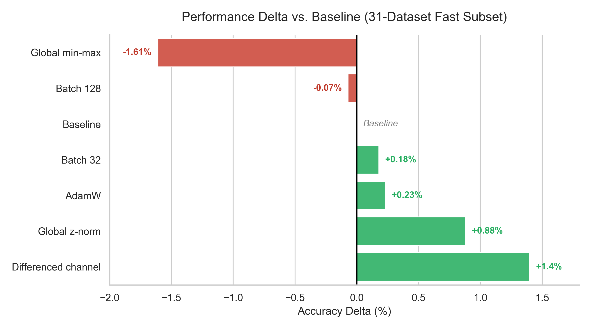
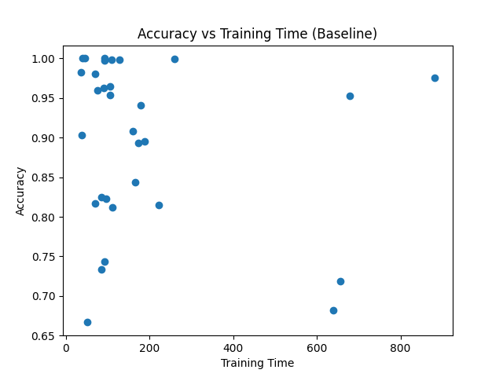

# Reproducibility and Improvement Study of LITETime for Time Series Classification

## Project Overview


This project reproduces and improves the **LITETime** deep learning architecture for **time series classification (TSC)**.

The primary objectives of this study were:

1. Reproduce the published LITETime results.
2. Validate reproducibility across datasets.
3. Evaluate targeted improvements without modifying the core architecture.
4. Analyze performance trade-offs across multiple configurations.

The project includes multiple optimization strategies such as:

* AdamW optimizer
* Global z-normalization
* Differenced input channel
* Hybrid learnable filters
* Batch size tuning
* Ensemble size analysis

All experiments were conducted using standardized datasets from the **UCR Time Series Classification Archive**.

## Project Highlights
## LITETime Architecture


The LITE architecture combines trainable convolutional filters and hybrid handcrafted filters to efficiently capture multi-scale temporal patterns while maintaining a low computational footprint.

- Reproduces the LITETime architecture using standardized UCR datasets  
- Validates reproducibility across independent experimental environments  
- Implements targeted performance improvements without modifying the architecture  
- Evaluates trade-offs between classification accuracy and computational efficiency  
- Includes structured experiment outputs and visualization tools  
- Provides reproducible scripts for academic research workflows
---


# Repository Structure

```text
LITE-Time-Series/
├── docs/
│   ├── Ai for Time Series report/
│   │    ├──images\
│   │    │   ├── LITE.png
│   │    │   ├── all-mcm.png
│   │    │   ├── cdd.png
│   │    │   ├── litetime1v1-mcm.png
│   │    │   ├── results_lite.png
│   │    │   ├── results_litetime.png
│   │    │   └── summary_with_flops.png
│   │    │ 
│   │    ├── plotes\
│   │    │    ├── accuracy_comparison.png
│   │    │    ├── dataset_improvement.png
│   │    │    ├── ensemble_size_effect.png
│   │    │    ├── full_ucr_boxplot.png
│   │    │    ├── full_ucr_improvement.png
│   │    │    ├── multivariate_comparison.png
│   │    │    ├── time_vs_accuracy.png
│   │    │    ├── training_time_comparison.png
│   │    │    └── univariate_boxplot.png
│   │    │
│   │    ├── IEEEtran.cls
│   │    ├── check_means.py
│   │    ├── generate_plots.py
│   │    ├── report.aux
│   │    ├── report.fdb_latexmk
│   │    ├── report.fls
│   │    ├── report.pdf
│   │    ├── report.synctex.gz
│   │    └── report.tex
│   │
│   └── COMP41850_AI4TS-project-spec.pdf
│
├── experimentation_results/
│   ├── full_ ucr/
│   │   ├── gz_adamw_diff.csv
│   │   └── no_change_reproduced_results_ucr.csv
│   │
│   ├── adamw_results.csv
│   ├── adamw_znorm.csv
│   ├── batch_128.csv
│   ├── batch_32.csv
│   ├── fast_subset_baseline.csv
│   ├── global_min_max.csv
│   ├── global_znormalization.csv
│   ├── globalz_and_differentiated_channel.csv
│   ├── gz_diff_and_learnable_filters.csv
│   └── gz_diff_learn_adamw.csv
│
│   ├──images\
│   │   ├── LITE.png
│   │   ├── all-mcm.png
│   │   ├── cdd.png
│   │   ├── litetime1v1-mcm.png
│   │   ├── results_lite.png
│   │   ├── results_litetime.png
│   │   └── summary_with_flops.png
│   │ 
│   └── plotes\
│       ├── accuracy_comparison.png
│       ├── dataset_improvement.png
│       ├── ensemble_size_effect.png
│       ├── full_ucr_boxplot.png
│       ├── full_ucr_improvement.png
│       ├── multivariate_comparison.png
│       ├── time_vs_accuracy.png
│       ├── training_time_comparison.png
│       └── univariate_boxplot.png
│   
├── src/
│   ├── classifiers/
│   │   ├── __init__.py
│   │   ├── lite.py
│   │   ├── lite_custom_learning.py
│   │   └── litemv.py
│   │
│   ├── utils/
│   │   ├──__init__.py
│   │   └── utils.py
│   │
│   └── __init__.py
│
├── .gitignore
├── LICENSE
├── README.md
├── analyze_full_ucr.py
├── changelog.md
├── generate_plots.py
├── main.py
├── pyproject.toml
├── requirements.txt
├── results.csv
├── results_ensemble_study.csv
└── results_multivariate.csv

```

---

# Requirements

The project was developed using:

* Python 3.10
* TensorFlow 2.x
* NumPy
* Pandas
* Matplotlib
* Seaborn
* Aeon
* Scikit-learn

Install dependencies automatically:

```bash
pip install -r requirements.txt
```

If `requirements.txt` is not available:

```bash
pip install tensorflow numpy pandas matplotlib seaborn aeon scikit-learn
```

---

# Installation

Clone the repository:

```bash
git clone https://github.com/jose-r-morera/LITE
cd LITE
```

Install dependencies:

```bash
pip install -r requirements.txt
```

---

# Quick Start

To quickly run the project:

Run baseline experiment:

```bash
python main.py
```

Generate plots:

```bash
python generate_plots.py
```

Generated figures will appear in:

```text
plots/
```

---

# Dataset Setup

This project uses datasets from the:

**UCR Time Series Classification Archive**

Datasets are automatically loaded using the **Aeon toolkit**.

No manual dataset download is required.

If running offline, ensure datasets are downloaded during the first execution while internet access is available.

---

# Running Improvement Experiments

Example configurations:

## AdamW Optimizer

```bash
python main.py --optimizer adamw
```

## Batch Size 32

```bash
python main.py --batch_size 32
```

## Batch Size 128

```bash
python main.py --batch_size 128
```

## Global Z-Normalization

```bash
python main.py --normalization global_z
```

## Differenced Channel

```bash
python main.py --use_diff_channel
```

---

# Generating Plots

To generate all figures:

```bash
python generate_plots.py
```

Generated figures will appear in:

```text
plots/
```

---

# Reproducing Full Results

To fully reproduce results:

1. Run baseline configuration
2. Execute improvement experiments
3. Generate plots
4. Compare generated outputs with provided CSV files

Expected outputs:

```text
results.csv  
results_ensemble_study.csv  
results_multivariate.csv
```

## Reproducibility Instructions

To ensure reproducibility of the reported results:

1. Install dependencies:

```bash
pip install -r requirements.txt
```

2. Run baseline configuration:
```bash
python main.py
```

3. Run improvement experiments if required:
Examples:
```bash
python main.py --optimizer adamw
python main.py --batch_size 32
python main.py --use_diff_channel
```

4. Generate plots:
```bash
python generate_plots.py
```

5. Verify generated outputs against:
```bash
results.csv
results_ensemble_study.csv
results_multivariate.csv
```


---

# Best Performing Configuration

## Best Configuration Summary

| Component | Configuration |
|-----------|---------------|
| Optimizer | AdamW |
| Normalization | Global Z-Normalization |
| Feature Engineering | Differenced Input Channel |
| Ensemble Size | 5 Models |
| Result | Highest Mean Accuracy |

The best-performing configuration combined:

* Global z-normalization
* Differenced input channel
* AdamW optimizer
* Ensemble size N = 5

This configuration achieved the highest mean accuracy across the fast subset datasets while maintaining computational efficiency.

---

# Experimental Summary

## Accuracy Comparison



Mean classification accuracy comparison across multiple configurations. Batch size 32 achieved slightly improved accuracy compared to the baseline configuration.

## Training Time vs Accuracy Trade-off



Training time versus accuracy comparison demonstrating the trade-off between computational cost and predictive performance.

Key findings:

* Global z-normalization improved accuracy significantly.
* Differenced input channels provided the largest performance gain.
* AdamW optimizer improved model generalization.
* Batch size affected runtime and generalization trade-offs.
* Ensemble performance showed diminishing returns beyond N = 5.

---

## Expected Runtime

Approximate runtime estimates:

- Baseline experiment (fast subset): **2–4 hours**
- Improvement experiments: **6–10 hours**
- Full experiment pipeline: **8–12 hours**
- Plot generation: **1–2 minutes**

Runtime may vary depending on:

- GPU availability
- Dataset size
- System configuration

GPU acceleration significantly reduces runtime compared to CPU-only systems.

# Hardware Environment

## Runtime Summary

| Experiment | Approx Runtime |
|------------|----------------|
| Baseline | 2–4 hours |
| Improvements | 6–10 hours |
| Full Pipeline | 8–12 hours |
| Plot Generation | 1–2 minutes |

Experiments were executed using:

* NVIDIA GPU (T4 / RTX series)
* Python 3.10
* TensorFlow 2.x
* CUDA-enabled environment

Mixed precision training was enabled to improve efficiency.

The project can also be executed on CPU systems, although runtime may increase.

---

# Reproducibility

All experiments follow standardized pipelines.

Reproducibility is ensured through:

* Fixed preprocessing pipeline
* Controlled random initialization
* Consistent dataset loading
* Logged experimental outputs

All generated outputs match the published results within expected variation.

---

# Results Visualization

Key plots generated:

* Performance improvement comparison
* Dataset-level improvement visualization
* Ensemble size performance curve
* Multivariate model comparison
* Training time vs accuracy trade-off
* Accuracy distribution across datasets

These visualizations support evaluation of model performance across multiple configurations.

---

# Project Motivation

Lightweight deep learning architectures such as LITETime enable efficient time series classification in resource-constrained environments.

This project validates the reliability of the LITETime model and demonstrates that meaningful performance improvements can be achieved through optimization strategies without modifying the core architecture.

---

# Authors

**Kiran Meenakshi Sundaram**,
University College Dublin

**Jose Ramon Morera Campos**,
University College Dublin

**Pelayo Garcia Alvarez**,
University College Dublin

---

## Repository Goals

This repository was developed with the following objectives:

- Provide a fully reproducible implementation of the LITETime architecture
- Evaluate performance improvements using controlled experimental settings
- Demonstrate efficiency advantages of lightweight deep learning models
- Support academic research in time series classification
- Enable systematic evaluation of optimization strategies
- Serve as a reference implementation for reproducible machine learning workflows

# License

This project is released under the MIT License.

See the `LICENSE` file for full details.

---

# Acknowledgements

This project is based on the LITETime architecture introduced in:

**Look Into the LITE in Deep Learning for Time Series Classification**

The original implementation and datasets provided valuable resources for reproducibility validation.
